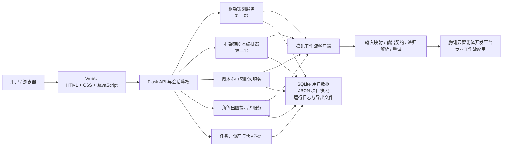
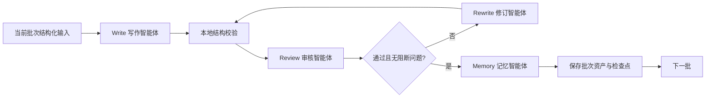

# Idea to Scripts 智能体技术说明、演示视频与答辩规划

> 文档用途：智能体比赛技术材料母稿  
> 对应系统：Idea to Scripts · AI 剧本研究与生产平台  
> 当前版本口径：以本仓库现有代码、腾讯智能平台工作流导出包和当前 WebUI 为准  
> 使用原则：技术事实可由代码或工作流文件核验；没有实测的数据不预先虚构

---

## 1. 项目一句话定义

Idea to Scripts 是一个面向长篇、分集式剧本生产的多角色工作流智能体系统。它把“灵感—结构化框架—分集剧本—质量审核—角色视觉提示词”拆成可控制、可审核、可恢复、可追踪的专业步骤，用本地确定性编排控制云端生成式智能体，降低一次性大模型生成在长文本场景中的失控、遗忘、格式漂移和前后矛盾问题。

更适合答辩现场的表达是：

> 我们不是让一个大模型一次写完整部剧，而是把编剧团队中的策划、世界观、人设、结构、冲突、正文、审核和记忆职责拆给不同的专业工作流，再由本地控制器像制片流程一样调度、验收和保存。

## 2. 参赛定位与问题定义

### 2.1 目标用户

- 短剧、网络剧、动画剧集的编剧与策划人员；
- 网文、小说、故事梗概向分集剧本改编的创作者；
- 需要批量评估剧本留存、节奏、爽点与合规风险的内容团队；
- 需要保持角色外观连续性的美术、分镜或 AI 出图团队；
- 教学、创作实训和小型内容工作室。

### 2.2 当前行业痛点

1. **长文本上下文容易失真。** 一次生成整部剧时，模型容易忘记早期设定，人物状态、道具、地点和情绪承接会逐集漂移。
2. **结果不可控。** 普通对话式生成往往只给自然语言结果，缺少固定字段、完整集号和可被程序验收的数据结构。
3. **修改成本高。** 某一批次失败或需要重写时，整部重跑会浪费时间和调用成本，也可能破坏已经确认的内容。
4. **质量审核与创作割裂。** 传统做法通常在成稿后人工通读，难以形成逐集分数、情绪曲线、跨集承接和修改优先级。
5. **创作偏好难以稳定复用。** 用户对类型、节奏、角色语言和视听风格的偏好，往往只能反复写进提示词，不能按阶段精确注入。
6. **多工具之间资产断裂。** 框架、剧本、审核报告和角色视觉提示词如果彼此独立，就会产生重复录入与版本不一致。

### 2.3 设计目标

- 将概率性的生成任务拆解为可验证的阶段；
- 让每个阶段只处理与其职责相关的上下文；
- 关键产物必须满足结构契约后才能进入下游；
- 支持批次生成、失败重试、断点续跑和已完成结果复用；
- 保留用户修改权，形成“人机协同”而非完全自动替代；
- 让同一资产继续进入剧本审核和角色视觉开发，形成闭环。

---

## 3. 系统总体架构

### 3.1 架构概览

系统采用“浏览器交互层—本地应用与编排层—云端专业工作流层—本地资产与证据层”的混合架构。



### 3.2 四层职责

| 层级 | 主要职责 | 现有实现 |
| --- | --- | --- |
| 用户交互层 | 输入、编辑、阶段确认、进度呈现、审核报告展示、导出 | Jinja2 模板、原生 JavaScript、页面专属 CSS |
| 应用与编排层 | API、鉴权、状态机、批次调度、审核—重写循环、恢复与持久化 | Flask、服务类、本地编排器、后台线程 |
| 智能体工作流层 | 按专业职责完成理解、生成、审核、改写和记忆 | 腾讯智能平台独立工作流应用 |
| 资产与证据层 | 项目快照、阶段缓存、历史版本、调试事件、TXT/DOCX 导出 | SQLite、JSON、运行目录、工作流导出包 |

### 3.3 为什么采用混合编排

云端生成式模型擅长语义理解、创意生成和文本判断，但不适合独自承担项目状态、精确集号、失败恢复和持久化。系统因此把职责分为两类：

- **云端智能体负责概率性任务：** 故事理解、结构规划、人物塑造、冲突设计、对白生成、质量判断、摘要记忆；
- **本地代码负责确定性任务：** 输入映射、任务顺序、字段校验、集数校验、分数求和、失败重试、批次拆分、状态保存、权限隔离和导出。

这种分工是系统可靠性的核心。模型可以提供创意，但不能绕过代码侧的结构验收直接污染下游资产。

---

## 4. 智能体端设计

### 4.1 智能体组织方式

当前主生成链路由 **18 个核心专业工作流** 构成，并挂接 **2 个专业辅助工作流**：剧本心电图审核与角色出图提示词生成。

这里的“多智能体”不是多个聊天机器人自由讨论，而是**按岗位拆分、由本地状态机统一编排的多角色工作流智能体系统**。这种表述更准确，也更容易由现有代码与工作流工程包证明。

### 4.2 18 个核心工作流

| 阶段 | 智能体职责 | 核心产物 | 对下游的作用 |
| --- | --- | --- | --- |
| 01 | 提取故事梗概 | 已确认的故事信息 | 清洗原始材料，建立创作基线 |
| 02 | 世界观设计 | 世界规则、时空与社会环境 | 约束人物行为与事件可行性 |
| 03 | 人设方案撰写 | 角色档案、动机、关系与语言特征 | 支撑故事线、对白和视觉一致性 |
| 04 | 三幕十五节拍生成 | 15 节拍时间线与解释 | 建立全剧结构骨架 |
| 05 | 人物故事线整理 | 主配角故事线 | 校正人物弧光与交叉关系 |
| 06 | 整体改编指引 | 改编策略与执行原则 | 统一类型、节奏和视听方向 |
| 07 | 最终框架策划包 | 可进入生产的框架资产 | 作为框架转剧本的唯一上游基线 |
| 08 | 场景字典提炼 | 场景字典、世界规则摘要 | 统一场景命名和空间规则 |
| 09 | 人物服饰映射 | 人物—服装—场合映射 | 保持跨集视觉连续性 |
| 10 | 丰富分集计划 | 完整增强分集计划 | 把框架细化为逐集生产输入 |
| 11_01 | 因果冲突计划撰写 | 当前批次冲突推进计划 | 先解决“为何发生、如何推进” |
| 11_02 | 因果冲突计划审核 | 通过标志、阻断问题、修改意见 | 独立评价写作结果 |
| 11_03 | 因果冲突计划修订 | 修订后的冲突计划 | 只针对审核问题改写 |
| 11_04 | 因果冲突记忆 | 跨批次冲突记忆 | 向下一批传递未解决矛盾与状态 |
| 12_01 | 剧本正文撰写 | 场景、动作和对白融合稿 | 将结构计划转化为可读剧本 |
| 12_02 | 剧本正文审核 | 通过标志、阻断问题、修改意见 | 评价完整性、连续性和可拍性 |
| 12_03 | 剧本正文修订 | 修订后的批次正文 | 基于审核证据定向重写 |
| 12_04 | 剧本正文记忆 | 跨批次剧情与角色状态摘要 | 支撑后续批次上下文连续 |

### 4.3 两个专业辅助工作流

| 辅助智能体 | 输入 | 输出 | 特点 |
| --- | --- | --- | --- |
| 剧本心电图审核 | 完整剧本或上传文件、前序审核记忆、当前批次正文 | 逐集五维评分、情绪节点、跨集分析、修改计划 | 默认五集一批，严格验证，失败自适应拆分并断点续跑 |
| 角色出图提示词 | 单个选定角色、人物档案、服饰映射、场景道具、用户视觉要求 | 正向/负向提示词、连续性锁定、多视图提示词 | 只处理单角色，按证据优先级生成稳定视觉描述，不直接生成图片 |

### 4.4 智能体协作协议

每个工作流不是靠自由文本“猜”上一步结果，而是通过注册表和契约明确：

- 本阶段使用哪个 AppKey；
- 请求变量叫什么、对应本地哪个字段；
- 输出应出现在哪个字段；
- 输出类型是字符串、对象还是数组；
- 哪些别名可兼容历史工作流；
- 哪些字段缺失时必须重试或停止。

主生成链的每个工作流使用独立 API Key。当前阶段没有配置对应 Key 时，代码会明确报错，不会静默调用其他阶段，从而避免“请求成功但实际跑错智能体”的隐性错误。

### 4.5 写作—审核—改写—记忆闭环

阶段 11 和阶段 12 都采用闭环，而不是单次生成：



审核结果采用明确字段，例如 `passed`、`rewrite_required`、`blocking_issues`。如果模型返回“未通过但不需要重写”的矛盾结果，本地代码会强制转为需要重写。即便模型判断通过，本地集号、结构和字段校验仍可以否决该结果。

循环次数有配置上限并受代码硬上限保护，防止无限自循环。达到上限后，系统保留已有进度并按具体链路进入失败、恢复或结构有效结果保留策略。

### 4.6 跨批次记忆

系统不把全部历史正文无上限塞入下一次请求，而是结合三类上下文：

1. 当前批次的分集计划、冲突计划和人物服饰映射；
2. 邻近批次正文或摘要；
3. 由记忆智能体生成的角色状态、未解决冲突、情绪债务、道具与承接信息。

本地 `compact_context` 服务会把人物、场景、世界观、服饰等信息压缩为当前阶段真正需要的字段；脚本阶段还有软、硬长度限制和多级压缩策略。这样既控制请求体，也降低无关上下文干扰。

### 4.7 用户偏好与知识注入

用户可以选择内置或自定义偏好标签，也可以按阶段维护提示信息。系统把偏好拆为 12 类阶段键：基础、世界观、人物、节拍、人物故事线、改编指引、策划包、场景、服饰、分集、冲突和正文。

偏好只注入当前相关工作流，而不是把一段通用提示词重复发送给所有阶段。这样能减少偏好之间的相互干扰，并让“人物对白偏好”与“世界观规则偏好”分别生效。

---

## 5. 三条核心业务链路

### 5.1 灵感到框架：01—07

1. 用户输入故事材料、题材、目标集数、单集字数及偏好；
2. 01 提取和确认基础故事信息；
3. 02、03 分别建立世界观和人物；
4. 04 生成三幕十五节拍，代码检查是否为完整 15 个节拍；
5. 05 整理人物故事线；
6. 06 生成整体改编指引；
7. 07 汇总为最终框架策划包；
8. 用户可以修改、应用、回看历史版本并保存为框架资产。

阶段 04 对“只返回单个 beat 而非 15 节拍数组”的常见异常提供一次定向纠错请求；仍不完整时拒绝伪装成成功结果。单集字数直接映射为 `character_count`，不使用“分钟 × 语速”等隐式换算。

### 5.2 框架到剧本：08—12

1. 用户选择一个已保存的框架资产；
2. 08 从策划包提炼规范场景字典和世界规则摘要；
3. 09 建立角色在不同情境下的服饰映射；
4. 10 生成覆盖全部集数的增强分集计划；
5. 系统按批次执行 11 的冲突写作—审核—改写—记忆；
6. 当前批次冲突计划通过后，执行 12 的正文写作—审核—改写—记忆；
7. 每个成功批次立即写入资产；
8. 所有批次完成后拼接全剧，可导出 TXT 或 DOCX。

阶段 08、09、10 的关键结构缺失时不能进入下游。阶段 12 启动前也会确认对应批次的阶段 11 已完整，避免正文在没有因果计划时继续生成。

### 5.3 剧本心电图审核

#### 输入预处理

- 支持从已有剧本资产选择，也支持粘贴文本或上传文件；
- 本地先识别“第 N 集”标题；
- 拒绝空集、重复集号、缺集和乱序剧本；
- 计算规范化剧本内容哈希，用于识别同一内容与恢复运行。

#### 默认批次和失败策略

当前审核的准确策略是：

1. 默认按 **5 集一批**；
2. 每个批次最多尝试 **2 次**完整格式请求；
3. 五集批次连续失败后，拆为 **2 + 2 + 1**；
4. 两集批次连续失败后，拆为 **1 + 1**；
5. 每个成功子批次立即保存并更新审核记忆；
6. 只有单集连续失败，当前运行才停止；
7. 用户点击继续检测时，从第一个未完成集开始，不重跑已验收集数。

因此不能简单表述为“失败后直接全部改成两集一批”。更准确的说法是：**系统采用 5 → 2 → 1 的自适应降级粒度，且已完成前缀始终保留。**

#### 五维评分模型

每集总分为五个固定维度之和：

\[
S_e = H_e + P_e + R_e + F_e + C_e
\]

其中：

| 维度 | 最高分 | 评价重点 |
| --- | ---: | --- |
| 开篇钩子 | 15 | 开场吸引、问题建立、继续观看动力 |
| 冲突与节奏 | 25 | 冲突密度、升级逻辑、节奏拖沓与突兀 |
| 爽点与回报 | 25 | 情绪兑现、反转、阶段性满足和铺垫回收 |
| 人物、对白与可拍性 | 20 | 人物动机、语言辨识度、场面执行成本 |
| 市场与合规 | 15 | 受众适配、内容风险、传播与制作风险 |

代码重新求和五维分数；如果远端报告的 `episode_score` 与维度合计不一致，则批次无效。全剧展示层同样以维度合计为准，不盲信模型单独返回的总分。

#### 心电曲线

每集返回若干剧情节点，节点值限制在 \([-5,5]\)：

- 正值表示吸引力、冲突、爽点或情绪回报增强；
- 负值表示拖沓、信息重复、动机断裂或留存风险；
- 零附近表示过渡、信息铺垫或情绪平稳段。

所有批次完成后，本地按集号和集内节点顺序合并曲线，并重新生成全局节点索引。曲线不是医学检测，也不声称预测真实播放量；它是对剧情情绪与留存风险的结构化辅助评价。

#### 跨集承接

每集必须包含 `continuity_review`，每批必须包含 `boundary_review` 和 `next_audit_memory`。审核记忆保存上一集结束场景、角色状态、未解决动作、情绪债务、伏笔回收和下一批观察点，最终用于形成：

- 全剧强弱总结；
- 单集分数趋势；
- 最佳集与最弱集；
- 跨集钩子、人物弧和爽点分布问题；
- 全局修改优先级。

---

## 6. 代码端技术实现

### 6.1 技术栈

| 类别 | 技术 | 用途 |
| --- | --- | --- |
| Web 后端 | Python、Flask | 页面路由、JSON API、会话鉴权、文件下载 |
| 工作流通信 | requests、腾讯 ADP API | 调用远端专业工作流，兼容私有部署与公有云协议 |
| 数据处理 | Python 标准库、PyYAML | JSON/YAML 解析、哈希、批次与契约处理 |
| 用户数据 | SQLite、Werkzeug 密码哈希 | 用户注册、登录和密码管理 |
| 运行资产 | 本地 JSON 文件 | 项目快照、阶段结果、审核运行与恢复点 |
| 文档导出 | python-docx | 剧本和工具结果的 DOCX 导出 |
| 前端 | HTML、CSS、原生 JavaScript | 不依赖大型前端框架的交互式工作台 |
| 测试 | unittest 风格测试文件 | 工作流协议、恢复、审核和提示词服务回归 |

### 6.2 关键代码模块

| 模块 | 职责 |
| --- | --- |
| `app/server.py` | Flask 应用、页面和 API 路由、框架转剧本阶段接口 |
| `app/services/tencent_workflow_registry.py` | 工作流注册表、AppKey 环境变量、输入输出字段映射 |
| `app/services/tencent_workflow_client.py` | 请求构造、HTTP 重试、SSE/JSON 解析、响应包递归解封装 |
| `app/services/workflow_contracts.py` | 各阶段输入输出契约 |
| `app/services/workflow_output_validation.py` | 类型、字段和结构校验 |
| `app/services/framework_planner_service.py` | 01—07 阶段调用、结果标准化、15 节拍保护和历史版本 |
| `app/orchestrators/workflow_orchestrator.py` | 主工作流状态机、批次循环、审核改写闭环、上下文压缩 |
| `app/services/task_manager.py` | 任务管理门面，组合生命周期、快照、缓存和导出能力 |
| `app/services/project_snapshot_store.py` | 项目资产持久化、恢复检查点、日志和公开资产视图 |
| `app/services/user_knowledge_store.py` | 用户标签、阶段偏好和知识注入 |
| `app/services/script_audit_batch_service.py` | 心电图解析、批次队列、5→2→1 拆分、持久化和续跑 |
| `app/services/script_audit_ecg_parser.py` | 审核结果标准化、分数重算、曲线与前端视图模型 |
| `app/services/character_image_prompt_service.py` | 单角色证据整理、提示词调用和输出标准化 |

### 6.3 API 分组

系统 API 可以按业务划分为：

- 用户与账户：当前用户、用户名和密码修改；
- 框架策划：01—07 阶段调用、阶段 04 结构评分、历史版本、资产保存；
- 框架转剧本：资产同步、08—12 阶段、运行状态、锁定与导出；
- 剧本心电图：新建审核、查询进度、继续检测、读取调试信息、上传文件解析；
- 角色视觉提示词：读取角色上下文、生成单角色提示词；
- 任务与项目：创建、查询、暂停、继续、重试、终止、回滚、删除和下载；
- 知识偏好：标签增删改查、选择标签、阶段偏好保存。

### 6.4 请求与响应兼容

腾讯平台不同部署可能返回普通 JSON、SSE 事件流、多层 `Output` 包装、JSON 字符串或再次嵌套的 JSON 字符串。客户端会：

1. 判断 Content-Type 与正文特征；
2. 解析 SSE 的最终事件或回复；
3. 递归遍历 `Output`、`reply`、`content`、`data`、`result` 等候选字段；
4. 将候选结果包装为当前阶段期望字段；
5. 只有通过契约校验的候选才被接受。

私有部署可把开始节点变量放到顶层 `WorkflowInput`，公有云模式可使用 `CustomVariables`。这层协议适配让上层业务逻辑不必感知部署差异。

### 6.5 契约驱动的质量门

契约校验分为三层：

1. **传输层：** HTTP 是否成功、响应是否可解析；
2. **结构层：** 必填字段、字段类型、合法别名是否满足约定；
3. **业务层：** 集号是否完整、15 节拍是否齐全、分数是否等于维度之和、记忆是否覆盖当前批次。

异常结果不会仅因为 HTTP 200 就被视为成功。格式异常可以触发定向重试；重试耗尽后保存调试证据和当前检查点。

### 6.6 任务状态与断点恢复

任务由状态、当前阶段、批次范围、已生成集数、阶段产物、日志和恢复检查点组成。关键节点调用 `checkpoint`，任务管理器把快照写入本地 JSON。

暂停、网络波动或进程异常后，系统根据已保存的正式产物推导第一个未完成批次。只有“正文与对应记忆均存在”的批次才能被直接复用，防止跳过记忆后造成下一批上下文断层。

心电图审核按已完成集号恢复，而不是按旧批次数恢复，因此即使批次策略发生变化，也不会重复审核已经保存的集数。

### 6.7 并发和前台响应

长耗时任务在后台线程运行，API 先返回运行标识。浏览器随后轮询运行状态并更新当前阶段、批次和结果。这样避免单个 HTTP 请求长期占用页面，也允许用户刷新后恢复界面。

当前实现适合作品演示和单机/小团队场景。若进入大规模生产，应把后台线程迁移到独立任务队列，并增加多进程锁、集中式状态存储和任务超时治理。

### 6.8 持久化与导出

- 用户账户写入 SQLite，密码使用哈希保存；
- 项目和任务快照写入 `runtime_data` 下的 JSON 资产；
- 框架策划阶段保存历史版本和最新成功版本；
- 心电图每个成功批次立即写入独立运行记录；
- 调试记录保存请求字段类型、长度、哈希、请求标识和错误摘要，不记录 API Key；
- 最终剧本支持 TXT 和 DOCX 导出。

---

## 7. 前端与用户之间的技术实现

### 7.1 交互设计原则

前端不是单纯展示模型答案，而是把生成过程变成一个可操作的生产工作台：

- 用户可以按阶段生成和确认，而不是被迫等待全链路结束；
- 每阶段结果可以修改，应用后才作为下游正式输入；
- 长任务显示当前阶段、批次、完成度和可恢复状态；
- 刷新页面后优先从后端资产恢复，浏览器本地状态只作轻量辅助；
- 资产可以在框架、剧本、审核和角色提示词页面之间传递。

### 7.2 页面与用户旅程

| 页面 | 用户行为 | 系统反馈 |
| --- | --- | --- |
| 工作台首页 | 新建框架、进入已有资产、选择工具 | 显示功能入口和项目资产 |
| 新建框架 | 输入故事与生产参数，逐阶段生成、编辑、应用 | 展示 01—07 结果、历史版本和阶段状态 |
| 框架到剧本 | 选择框架，依次运行 08—12，阅读批次结果 | 展示场景、服饰、分集、冲突、正文及运行状态 |
| 剧本心电图 | 选择资产/粘贴/上传，启动或继续审核 | 展示总分、五维评分、全剧曲线、逐集和跨集结论 |
| 角色出图 Prompt | 选择角色和服装，补充视觉要求 | 生成可复制的正向、负向、多视图与连续性提示词 |
| 项目/社区 | 管理自己的项目或查看已公开完成作品 | 项目恢复、下载、公开展示 |

### 7.3 前端状态恢复

框架策划页面使用本地存储保留草稿、展开状态和偏好，但阶段正式结果会同步到后端资产。框架转剧本页面会保存当前资产 ID、运行阶段和阅读位置；如果全剧正文超过浏览器存储配额，则自动退化为轻量恢复信息，以后端资产为准。

剧本心电图页面保存当前运行 ID，刷新后查询后端运行记录。轮询间隔会根据运行状态调整，成功、失败或继续检测后重新渲染报告。

### 7.4 输入安全与用户反馈

- 上传内容先在服务端提取和校验；
- API 错误转换为可读提示，而不是只在控制台报错；
- 执行按钮在运行中进入受控状态，降低重复提交；
- 资产 ID 与用户 ID 在服务端校验，不能只依赖前端隐藏；
- 公开社区只展示用户主动设为公开且已完成的资产。

### 7.5 当前视觉系统与技术叙事

WebUI 使用黑白灰、米白底、细线网格、科研坐标和轨道图形，定位为“未来 AI 剧本研究实验室”。视觉层没有改变原有业务结构，它用于强化三点认知：

- 系统是研究与生产工具，而非普通聊天框；
- 每个阶段像档案条目一样可编号、回看和验收；
- 心电图、场景字典和角色映射是可分析的数据资产。

答辩中不应把视觉样式本身作为核心算法创新，但可以把它作为“复杂智能体流程的信息可视化与认知减负”来说明。

---

## 8. 核心算法与机制

### 8.1 分阶段有向工作流

主流程可视为有向图 \(G=(V,E)\)。节点 \(V\) 是专业工作流，边 \(E\) 是经过契约校验的结构化产物。只有上游节点输出满足约束 \(C_i\) 时，下游节点才可执行：

\[
execute(v_{i+1}) \iff validate(output(v_i), C_i)=true
\]

这使模型生成从“聊天结果”变为“具有前置条件和验收规则的工程产物”。

### 8.2 双重审核

系统同时使用：

- **语义审核：** 由审核智能体判断冲突、动机、节奏、连续性和可拍性；
- **确定性审核：** 由代码判断字段、类型、集号、数量、分值和记忆覆盖。

语义审核解决“内容好不好”，确定性审核解决“数据是否完整且可安全进入下一步”。两者互补。

### 8.3 自适应批次策略

长文本被切成批次以控制上下文长度和失败范围。以心电图为例，初始粒度 \(b_0=5\)。若同一批次两次不能产生合法结果，则使用：

\[
b_{next}=\begin{cases}
2, & b>2 \\
1, & 1<b\le2
\end{cases}
\]

拆分只作用于失败区间，成功前缀保持不变。这相当于以更小的故障域换取更高的完成率，而不是让整部作品回滚。

### 8.4 检查点与幂等恢复

每个成功批次被视为一次提交。恢复时计算：

\[
pending = all\_episodes - accepted\_episodes
\]

若未完成集号不是连续后缀，系统拒绝自动续跑，防止状态损坏。请求内容哈希和运行标识用于识别重复内容与现有运行。恢复的目标不是简单“重新执行”，而是从最近稳定检查点继续。

### 8.5 上下文压缩

不同智能体接收不同投影：

\[
context_i = projection_i(project\_state)
\]

例如场景智能体重点接收世界观与场景需求，服饰智能体接收人物身份、场合与服装规则，正文智能体接收当前批计划、冲突计划、邻近摘要和连续性记忆。投影式上下文比把完整项目全文发送给每个节点更节省长度，也减少不相关信息对生成的干扰。

### 8.6 证据优先的角色视觉提示词

角色提示词的事实优先级为：

1. 人物源档案；
2. 当前服饰映射与选中服装；
3. 场景和道具上下文；
4. 用户新增视觉要求。

当新增要求与核心人物设定冲突时，优先保持角色身份与连续性，再给出折中描述。一次只处理一个选中角色，避免模型把多个人物特征混在一起。

---

## 9. 可核验的创新亮点

### 创新一：把长篇创作改造为契约驱动的智能体工程

不同于“一条长提示词生成整部剧”，系统把创作拆成 18 个专业工作流，并在工作流之间设置字段、类型、集号和完整性门槛。创新点不只是工作流数量，而是**生成结果必须成为可验收、可持久化、可继续加工的数据资产**。

### 创新二：独立写作、审核、改写和记忆角色形成闭环

写作智能体不自我打分，审核智能体给出阻断问题，改写智能体基于明确问题修订，记忆智能体只负责提取跨批次状态。本地控制器处理矛盾审核结果和循环上限，降低单模型自评偏差。

### 创新三：5→2→1 的故障域自适应审核

剧本心电图不是固定五集失败后整任务报错，而是把失败批次逐级缩小，并立即提交成功子批次。该机制同时兼顾正常情况下的效率与异常情况下的完成率。

### 创新四：跨集“状态交接”而非只有摘要

记忆不仅保存剧情摘要，还保存上一集结束场景、人物状态、未解决动作、情绪债务、伏笔、关系和下一批观察点。它更接近编剧团队的 continuity bible（连续性手册）。

### 创新五：模型审核与代码硬校验的双层质量门

模型擅长语义判断，代码擅长确定性约束。系统让二者共同决定是否通过，例如模型判断“通过”但漏集、分数错误或缺少记忆时，结果仍会被拒绝。

### 创新六：阶段级个性化知识注入

用户偏好被拆到 12 类阶段，而不是作为全局文本无差别附加。这让类型风格、人物语言、冲突节奏与视听表达在对应智能体中更精确地生效。

### 创新七：同一创作资产贯通策划、剧本、审核和视觉开发

最终框架可以继续生成剧本，剧本可以直接进入心电图审核，人物档案和服饰映射可以继续生成角色出图提示词，避免多工具重复录入和版本漂移。

### 创新八：为生成式工作流建立可诊断证据链

系统记录阶段、批次、重试次数、输入字段类型与长度、内容哈希、远端请求标识和格式失败原因，同时不写入 API Key。它使“模型为什么失败、失败在哪里、是否保存进度”可以被工程人员追踪。

---

## 10. 应用场景

### 10.1 短剧快速开发

从故事梗概生成结构化策划包和分集正文，再通过心电图定位开头钩子、节奏和爽点不足，适合小团队缩短前期迭代时间。

### 10.2 小说或网文改编

先提取原作核心信息，再建立世界观、人设、15 节拍和人物线，能够在改编时保留核心设定并重组剧集节奏。

### 10.3 编剧教学与实训

学生可以观察从梗概到节拍、从冲突计划到正文的中间产物，并对照审核报告理解结构问题，而不是只看到最终答案。

### 10.4 内容团队内部评审

把已有剧本导入心电图，形成统一维度的逐集报告、情绪曲线和修改优先级，作为人工剧本会的辅助材料。

### 10.5 角色视觉前期开发

利用人物档案、服饰映射与场景信息生成稳定提示词，为概念图、分镜和角色连续性测试提供输入。

---

## 11. 合规、伦理与风险说明

### 11.1 人机责任边界

- 系统定位为创作辅助与质量分析工具，最终选题、修改、发布和商业决策由用户负责；
- 模型评分和心电曲线属于辅助意见，不代表真实播放数据、平台审核结论或投资回报预测；
- UI 应明确标注 AI 生成或 AI 辅助内容，避免把机器结论包装为权威事实。

### 11.2 版权与知识产权

- 用户应确认上传原作、剧本和角色资料具有合法使用权；
- 导出材料中建议保留来源、修改记录和 AI 辅助说明；
- 不承诺生成内容绝对不与既有作品相似，正式发布前仍需人工查重与版权审查；
- 角色视觉提示词应避免要求模仿在世艺术家的独特风格，优先使用构图、材质、时代、光线等可描述特征。

### 11.3 隐私与数据安全

当前系统具备用户会话、用户 ID 资产隔离、密码哈希和 API Key 环境变量管理。调试日志不保存 API Key，并尽量以长度、哈希和摘要替代完整敏感内容。

同时必须如实说明：当前项目会在本机运行目录持久化用户提交的创作内容和中间产物。若用于正式互联网服务，仍需增加：

- HTTPS 与安全 Cookie；
- CSRF 防护、请求限流和上传文件安全扫描；
- 运行数据加密、备份和明确的删除周期；
- 管理员权限与审计日志；
- 第三方模型平台的数据处理告知和用户授权。

### 11.4 偏见、幻觉与内容安全

- 模型可能生成刻板印象、事实错误、不当内容或不符合现实制作条件的建议；
- 市场与合规维度只能做初筛，不能替代专业法律、平台审核或伦理审查；
- 对未成年人、暴力、歧视、隐私、医疗、法律等高风险主题应增加专项规则和人工复核；
- 结构校验只能证明格式完整，不能证明内容绝对正确。

### 11.5 可追溯与最小化原则

- 按阶段保存产物和错误证据，便于定位责任边界；
- 调试记录只保留排障需要的信息；
- 对外展示前去除 API Key、内部地址、用户隐私和未授权原文；
- 比赛提交的 `.env` 必须使用占位符，真实凭据不得进入代码包或演示视频。

---

## 12. 程序交付材料规划

本次先规划，不在此文档中打包。正式提交时建议使用以下结构：

```text
Idea-to-Scripts-Competition/
├─ README.md                         # 项目简介、快速启动、默认账号说明
├─ 智能体设计说明书.pdf               # 由本母稿精简排版生成
├─ source/
│  └─ workflow_code_skeleton/       # 完整后端、前端、测试代码
├─ workflows/
│  ├─ 01-07/                        # 框架策划工作流导出包
│  ├─ 08-12/                        # 框架转剧本工作流导出包
│  └─ auxiliary/                    # 心电图与角色提示词工作流工程包
├─ config/
│  ├─ .env.example                  # 仅变量名和占位值
│  └─ requirements.txt
├─ scripts/
│  ├─ setup_windows.ps1
│  └─ run_windows.ps1
├─ samples/
│  ├─ example_input.txt
│  ├─ example_framework.json
│  ├─ example_script.txt
│  └─ example_audit.json
├─ tests/                            # 回归测试
├─ demo/
│  └─ 作品演示视频.mp4
└─ defense/
   └─ 答辩PPT.pptx
```

### 12.1 必须包含的运行说明

1. 操作系统和 Python 版本；
2. 创建虚拟环境与安装 `requirements.txt`；
3. 从 `.env.example` 复制 `.env`；
4. 配置各阶段独立 AppKey 与 API 地址；
5. 私有部署和公有云输入模式的区别；
6. Windows 一键启动脚本；
7. 默认访问地址与首个账户注册方式；
8. 示例资产导入方式；
9. 无网络、Key 失效、远端格式异常时的提示；
10. 清理运行数据和撤销公开资产的方法。

### 12.2 提交前安全检查

- 删除真实 `.env`、Cookie、账户数据库和私有 API Key；
- 匿名化日志、剧本样例和用户目录；
- 不提交大体积缓存、临时调试文件和失败响应原文；
- 检查所有工作流导出包是否能被赛事平台导入；
- 用一台全新机器完整执行一次安装和启动说明。

---

## 13. 五分钟内作品演示视频脚本

### 13.1 总体策略

建议成片控制在 **4 分 35 秒至 4 分 50 秒**，为片头、转场或平台误差预留余量。不要在视频里等待所有云端工作流跑完：现场启动一个真实阶段证明可运行，再切换到预先生成的同一项目资产展示完整链路，并在字幕中标明“为压缩演示时长，以下使用预生成结果”。

视频只讲一条主线：

> 一个故事如何被专业智能体拆解成框架和剧本，再由另一个审核智能体形成可执行的修改报告。

### 13.2 分镜与旁白

| 时间 | 画面操作 | 建议旁白 | 必须让评委看到的证据 |
| --- | --- | --- | --- |
| 00:00—00:18 | 片头，快速掠过框架、剧本、心电图三个页面 | “长篇剧本不是一次生成问题，而是一个需要结构、连续性、审核和恢复机制的生产问题。Idea to Scripts 用多角色工作流智能体完成从灵感到剧本再到质量分析。” | 产品名、三个核心页面 |
| 00:18—00:38 | 展示简化架构动画或静态图 | “系统由本地确定性编排和云端专业工作流组成。18 个核心工作流负责创意生产，两个辅助工作流负责剧本审核和角色视觉提示词。” | 18+2、云端智能体与本地控制器分工 |
| 00:38—01:18 | 新建框架，输入一个精简故事，设置集数与单集字数，选择偏好标签，点击阶段 01 | “用户提供故事和生产参数，偏好会按阶段注入，而不是重复塞给所有智能体。系统从故事梗概、世界观、人设到三幕十五节拍逐步生成，每一步都可查看、修改和确认。” | 输入界面、偏好标签、真实运行状态、可编辑结果 |
| 01:18—01:45 | 切换到预生成框架资产，依次点开 02—07 的结果，重点展开 15 节拍和最终策划包 | “这里使用同一项目的预生成结果压缩等待时间。阶段 04 必须返回完整 15 节拍；缺少结构时本地代码会拒绝进入下游。用户修改并应用后，结果才成为正式资产。” | 15 节拍、历史/修改/应用、最终框架资产 |
| 01:45—02:38 | 进入框架到剧本，展开 08 场景、09 服饰、10 分集；再展示 11 与 12 的批次状态 | “框架进入剧本生产后，系统先建立场景字典和人物服饰映射，再细化分集计划。每批冲突和正文都经过写作、审核、改写和记忆闭环；成功批次立即保存，刷新后也能继续。” | 场景字典、服饰映射、批次列表、写审改记状态 |
| 02:38—03:45 | 打开心电图，选择刚才的剧本资产，启动审核；随后切换到已完成报告，悬停曲线节点，展开五维、逐集和跨集分析 | “剧本审核默认五集一批，每集按钩子、冲突节奏、爽点回报、人物对白可拍性、市场合规五维计分。曲线把各剧情节点的情绪与留存风险映射到负五到正五，并保留逐集证据和修改建议。” | 总分、五维、曲线节点、逐集列表、跨集分析 |
| 03:45—04:10 | 用简短图示或调试视图展示 5→2→1，再点击一个可继续的审核记录 | “如果五集结果连续两次不完整，系统只把失败区间拆成二加二加一；两集仍失败再拆成单集。已完成集数不重跑，用户可从第一个未完成集继续。” | 5→2→1、已完成集号、继续检测 |
| 04:10—04:28 | 进入角色 Prompt，选中一个角色和服装，展示生成结果与复制按钮 | “同一人物资产还能生成带服装、场景和连续性锁定的角色提示词，为概念设计和分镜提供稳定输入。” | 单角色选择、服装、正负提示词、连续性字段 |
| 04:28—04:45 | 回到资产总览，显示框架、剧本、审核、导出；结束页 | “系统把创意能力封装进可验证、可恢复、可追踪的生产流程。它不是替用户做最终决定，而是帮助创作者更快获得结构化初稿和可执行的修改依据。” | 资产闭环、TXT/DOCX、项目名称 |

### 13.3 录屏准备清单

- 准备一个 8—10 集、内容足够丰富但不含敏感信息的演示剧本；
- 提前生成同一项目的 01—12 完整资产；
- 另准备一个停在审核中途、可以演示“继续检测”的运行记录；
- 浏览器缩放保持 90%—100%，关闭无关标签和个人信息；
- 为长字段准备展开位置，避免录屏时临时寻找；
- 鼠标移动慢，点击后至少停留 1 秒；
- 字幕统一突出“契约校验、写审改记、跨批次记忆、5→2→1、断点续跑”；
- 录制 1080p，保证心电图节点和小字可读；
- 避免在画面中出现 `.env`、API Key、内部地址和完整调试原文。

### 13.4 建议剪辑原则

- 不连续使用炫技转场，页面切换以硬切和轻微淡入为主；
- 云端等待超过 2 秒就加速或切预生成资产；
- 对 18 个工作流不要逐个念名称，用架构图和分组呈现；
- 心电图是最强可视化，应至少保留 55—65 秒；
- 结尾回到“创作资产闭环”，不要只停在某一张图表。

---

## 14. 答辩 PPT 内容规划

以下按 **10—12 页、约 8 分钟讲解**规划。如果赛事只给 5 分钟，可合并第 4/5 页、第 7/8 页和第 10/11 页。

### 第 1 页：封面

**标题：** Idea to Scripts——面向长篇分集剧本的多角色工作流智能体  
**副标题：** 从创意结构化、批次生产到剧本心电图审核  
**画面：** 首页或心电图的高质量局部，不堆功能截图。  
**一句话：** “让生成式 AI 从会写，走向可控、可审、可恢复的剧本生产。”

### 第 2 页：问题与需求

**标题：** 为什么“让模型直接写一部剧”不够  
**内容：** 上下文遗忘、前后矛盾、格式漂移、失败整部重跑、审核缺少量化依据。  
**图形：** 左边一次性生成的混乱链路，右边可控生产链。  
**讲解重点：** 先证明这是“长流程工程问题”，再介绍方案。

### 第 3 页：解决方案总览

**标题：** 18 个核心工作流 + 2 个专业辅助智能体  
**内容：** 01—07 框架、08—12 剧本、心电图、角色 Prompt。  
**图形：** 一条从 Idea 到 Framework、Script、Audit、Visual 的主链。  
**讲解重点：** 不逐一解释全部工作流，强调专业分工和资产贯通。

### 第 4 页：整体技术架构

**标题：** 本地确定性控制 + 云端生成式智能体  
**内容：** 浏览器、Flask API、编排器、腾讯工作流、契约校验、资产存储。  
**图形：** 使用第 3 章的四层架构图。  
**讲解重点：** 为什么任务状态、权限、集号和恢复必须由本地代码掌握。

### 第 5 页：核心智能体闭环

**标题：** Write—Review—Rewrite—Memory 不是一次性生成  
**内容：** 阶段 11 和 12 的循环、审核字段、代码二次校验、记忆进入下一批。  
**图形：** 闭环流程图。  
**讲解重点：** 写作和审核角色独立，模型通过不等于代码通过。

### 第 6 页：长剧本连续性机制

**标题：** 批次生成如何保持前后统一  
**内容：** 当前批计划、邻近摘要、连续性记忆、人物服饰映射、检查点。  
**图形：** 第 1—5 集提交记忆给第 6—10 集的时间线。  
**讲解重点：** 记忆不是整段历史原文，而是结构化状态交接。

### 第 7 页：剧本心电图

**标题：** 从“感觉不好”变成“定位到集和节点”  
**内容：** 五维评分、[-5,5] 节点曲线、单集分析、跨集趋势和修改优先级。  
**图形：** 一张清晰的真实报告截图，旁边列五维权重。  
**讲解重点：** 曲线是结构化辅助评价，不伪装成真实播放预测。

### 第 8 页：可靠性创新

**标题：** 失败时缩小故障域，而不是整部重来  
**内容：** 五集两次失败 → 2+2+1 → 单集；成功批次立即持久化；从首个未完成集恢复。  
**图形：** 5→2→1 拆分树。  
**讲解重点：** 同时说明请求格式契约、SSE/多层 JSON 解析和调试证据。

### 第 9 页：前端与用户价值

**标题：** 人在环中的可编辑生产工作台  
**内容：** 阶段确认、修改应用、历史版本、运行恢复、资产传递、导出。  
**图形：** 3—4 个克制的界面局部与用户旅程箭头。  
**讲解重点：** 用户始终拥有修改和发布决策权。

### 第 10 页：创新点总结

**标题：** 我们的创新不在“多调几次模型”  
**内容：** 契约驱动、多角色闭环、状态交接、自适应批次、阶段偏好、资产闭环、可诊断证据。  
**图形：** 建议只保留 4 个最强创新，其余口述。  
**推荐四项：** 契约驱动、写审改记、5→2→1、跨集状态交接。

### 第 11 页：应用、合规与验证

**标题：** 可落地场景与可信边界  
**内容：** 短剧、网文改编、教学、团队评审；版权授权、隐私、人工复核、AI 标识。  
**图形：** 场景图标 + 风险控制清单。  
**讲解重点：** 主动说明心电图不是播放量预测，体现诚实与技术边界意识。

### 第 12 页：结束与展望

**标题：** 从创作助手走向可治理的 AI 内容生产系统  
**内容：** 当前闭环、未来的协同任务队列、更多评审维度、团队权限与数据治理。  
**结束语：** “我们希望交付的不是一段偶然生成的文本，而是一条创作者能掌控的生产链。”

### 14.1 PPT 视觉建议

- 使用当前 WebUI 的黑白科研档案视觉，但 PPT 背景要比网页更干净；
- 一页只讲一个结论，标题直接写结论而不是写“系统介绍”；
- 架构和流程用细线图，不要贴满代码截图；
- 真实界面截图统一裁切比例，避免大小和边框风格不一致；
- 强调色最多一种，可用橙色小点延续当前导航标记；
- 正文字号不低于 20 pt，现场不展示不可读的日志全文；
- 动画只用于架构逐层出现和 5→2→1 拆分，不使用旋转、弹跳等效果。

---

## 15. 评委可核验的代码与材料证据

| 论点 | 建议展示的证据 |
| --- | --- |
| 18 个核心工作流 | `腾讯智能平台工作流文件/` 下 01—12_04 的 18 个导出包；注册表中的独立 AppKey 配置 |
| 写审改记闭环 | 编排器中的 `_run_batch_write_review_revise_loop` 与阶段 11/12 注册项 |
| 契约校验 | `workflow_contracts.py`、`workflow_output_validation.py`、`run_stage_with_contract_guard` |
| 5→2→1 | `script_audit_batch_service.py` 中 `BATCH_SIZE=5`、两次尝试和 `batch_adaptive_split` |
| 断点续跑 | 项目恢复检查点、`pending_episode_batches`、心电图 `resume_run` |
| 分数可信计算 | 心电图批次五维校验和展示层重新求和 |
| 阶段偏好 | `user_knowledge_store.py` 的 12 类阶段键与注入逻辑 |
| 协议兼容 | 腾讯客户端的 `WorkflowInput`/`CustomVariables` 和 SSE/递归响应解析 |
| 角色一致性 | `character_image_prompt_service.py` 的单角色证据输入与标准化输出 |
| 工程测试 | `tests/` 下工作流集成、私有平台协议、阶段恢复、心电图和角色提示词测试 |

---

## 16. 实测数据与截图待办

正式说明书和 PPT 应加入真实数据，但必须在统一测试环境中运行后填写。建议记录：

| 指标 | 测试方法 | 当前值 |
| --- | --- | --- |
| 01—07 完整成功率 | 固定 10 组输入，各运行一次 | 待实测 |
| 15 节拍结构完整率 | 统计阶段 04 首次与纠错后结果 | 待实测 |
| 08—12 完整成功率 | 固定 3 个不同集数项目 | 待实测 |
| 单批平均生成时长 | 分别统计 11、12 | 待实测 |
| 心电图五集批成功率 | 至少 20 个批次 | 待实测 |
| 自适应拆分挽救率 | 人为构造格式失败或收集真实失败 | 待实测 |
| 断点恢复重复集数 | 中途停止后续跑，检查重复集 | 目标为 0，待实测 |
| 心电图人工一致性 | 2—3 名评审与系统结论对照 | 待实测 |
| 刷新恢复成功率 | 在不同阶段刷新页面 | 待实测 |

建议准备以下截图：

1. 01—07 阶段纵向流程和完整 15 节拍；
2. 08 场景字典、09 服饰映射、10 分集计划；
3. 11/12 写审改记批次状态；
4. 心电图总览、曲线节点、逐集列表和跨集分析；
5. 5→2→1 调试事件或示意图；
6. 失败后继续检测并保留已完成集号；
7. 角色 Prompt 的证据来源与连续性锁定；
8. TXT/DOCX 导出和项目资产列表。

---

## 17. 答辩高频问题准备

### Q1：这和直接调用大模型写剧本有什么区别？

答：直接调用通常得到一次性自然语言结果。本系统把创作拆成专业岗位，所有关键节点有输入输出契约、独立审核、代码硬校验、批次记忆和恢复点。它解决的是长文本生产的可控性与工程可靠性，而不只是生成一段文本。

### Q2：为什么能称为智能体？

答：每个专业工作流都有明确目标、上下文、工具链和结构化输出，本地控制器会根据审核结果、失败类型和项目状态决定重试、改写、拆分或继续。它具有任务分解、状态感知、反馈闭环和自主执行能力；更准确地说，是编排式多角色工作流智能体系统。

### Q3：18 个工作流会不会只是简单串联？

答：不是。01—10 主要形成有前置依赖的生产链，11 和 12 内部是写作—审核—改写—记忆循环，心电图还会根据失败情况动态改变批次粒度。代码侧契约和检查点会影响下一步决策，因此不是固定提示词的机械串联。

### Q4：模型自己审核自己，结果可靠吗？

答：写作和审核使用独立工作流角色；同时系统不把模型判断作为唯一标准。集数、字段、类型、分值合计、记忆覆盖和结构完整性由本地代码再次验收。语义质量仍需人审，系统会明确这一边界。

### Q5：心电图分数有科学依据吗？

答：它是基于剧作结构与内容留存维度的辅助评分框架，不是临床心电图，也不是播放量预测模型。价值在于把评审意见定位到具体集、具体节点和具体修改任务，并支持同一套维度下的版本对比。

### Q6：为什么默认五集一批？

答：五集在调用效率、跨集观察和上下文长度之间取得平衡。当远端无法稳定返回完整五集结构时，系统只缩小失败区间为两集，再必要时缩小为单集，避免牺牲已完成结果。

### Q7：如何避免前后人物和服装不一致？

答：正文不只读分集计划，还读取人物档案、场景字典、服饰映射和上一批连续性记忆。批次完成后更新人物状态和未解决事项，再传给下一批。角色出图提示词也沿用同一人物和服饰资产。

### Q8：系统失败了怎么办？

答：网络和格式异常有受控重试；关键阶段和成功批次会落盘；重启或点击继续后从最近稳定检查点恢复。心电图按已完成集号恢复，不因批次变化重跑已验收内容。

### Q9：用户数据会发到哪里？

答：创作输入会按当前阶段需要发送给配置的腾讯工作流应用，本机也会保存项目快照用于恢复。正式部署必须在隐私声明中披露第三方处理和保留周期，并配套 HTTPS、加密、权限和删除机制。比赛包不会包含真实用户数据或密钥。

### Q10：下一步如何产品化？

答：把后台线程升级为分布式任务队列和集中状态存储，引入团队角色权限、版本差异对比、人工标注反馈、评审维度可配置以及经过授权的数据闭环评测。

---

## 18. 对外表述边界

为保证参赛材料可信，建议统一使用以下口径：

- 说“18 个核心工作流 + 2 个专业辅助工作流”，不要笼统说成“20 个完全自治智能体”；
- 说“辅助判断剧情情绪与留存风险”，不要说“精准预测爆款或播放量”；
- 说“支持断点续跑和成功批次复用”，不要承诺任何故障下都零损失；
- 说“密码哈希、用户资产隔离和调试最小化”，不要宣称当前已达到金融级或等保级安全；
- 说“模型审核 + 代码硬校验”，不要把格式校验等同于内容真实性；
- 说“可导出 TXT/DOCX 和提交工作流工程包”，不要在没有完成干净环境验证前声称一键部署到所有平台。

---

## 19. 后续材料制作顺序

1. 先用本文件整理正式《智能体设计说明书》，补入团队、赛事模板和真实测试数据；
2. 固定一个不含敏感信息的演示项目，跑通并保存完整资产；
3. 按第 13 章录制原始操作素材，再剪成 4 分 45 秒左右的演示视频；
4. 按第 14 章制作 10—12 页答辩 PPT；
5. 清理和复制程序交付包，在全新环境执行安装、启动、恢复和导出验收；
6. 最后统一检查说明书、视频、PPT 与代码中的数量、术语和功能口径。

